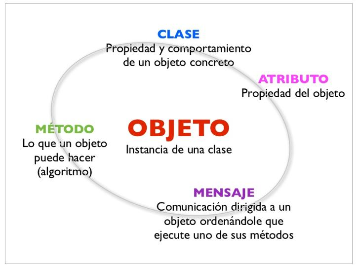
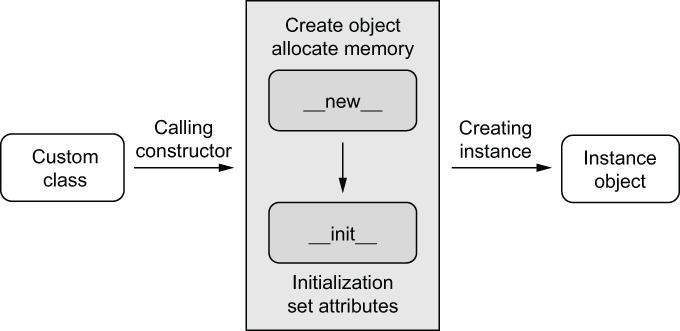
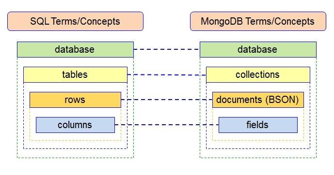
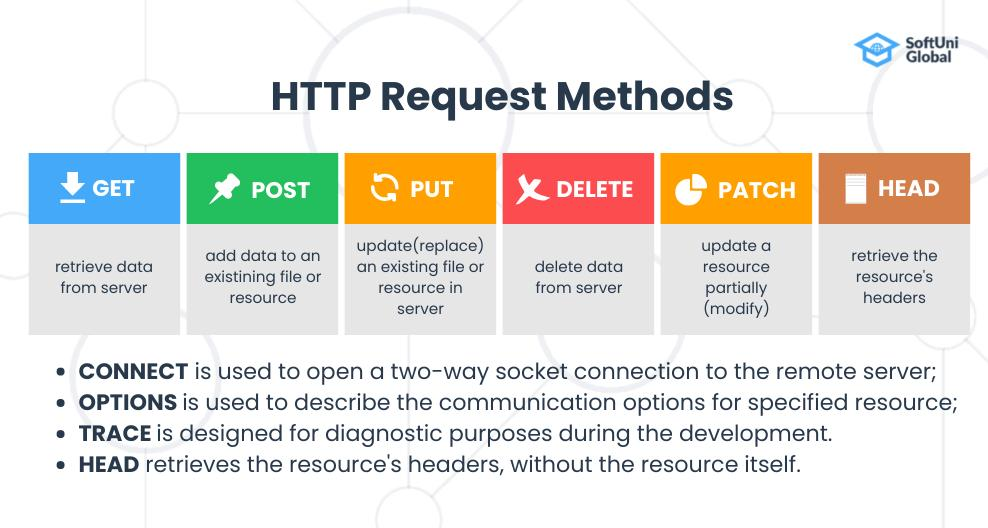
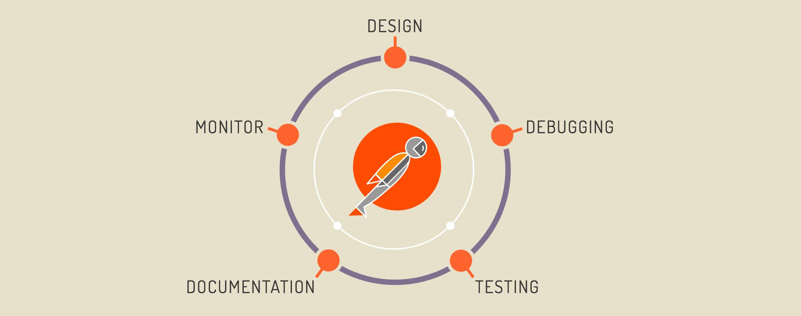
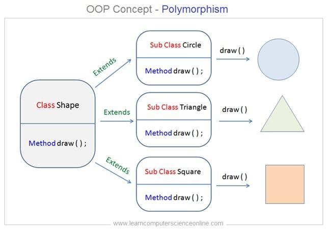
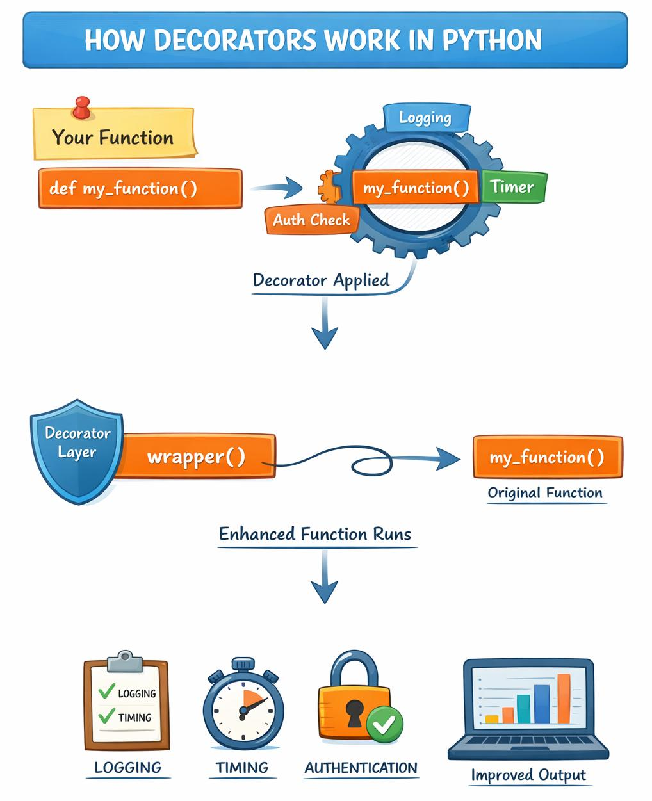

# Checkpoint 6 - Documentación Python, APIs y herramientas

## Introducción

En este documento se desarrollan conceptos fundamentales del desarrollo backend y del lenguaje Python. El objetivo no es únicamente responder preguntas, sino crear una documentación clara, completa y útil para personas que están comenzando en programación.

Cada apartado incluye una explicación detallada, ejemplos prácticos y aplicaciones reales, con el fin de facilitar la comprensión de los conceptos.

Este tipo de documentación es fundamental en el desarrollo profesional, ya que permite que otros desarrolladores comprendan el funcionamiento de un sistema.

---

## 1. ¿Para qué usamos clases en Python?

Las clases en Python se utilizan para **organizar el código y representar objetos del mundo real dentro de un programa**. Forman parte de la programación orientada a objetos, un paradigma que permite estructurar el software de forma más clara, reutilizable y escalable.

Una clase funciona como una plantilla o molde. A partir de ella se crean objetos, que son instancias con valores concretos.

### ¿Para qué se utilizan?

* Agrupar datos (atributos) y funciones (métodos)
* Evitar repetir código
* Facilitar el mantenimiento de programas grandes
* Modelar entidades reales como usuarios, productos o sistemas

### Ejemplo

```python
class Persona:
    def __init__(self, nombre, edad):
        self.nombre = nombre
        self.edad = edad

    def saludar(self):
        print(f"Hola, me llamo {self.nombre} y tengo {self.edad} años.")
```

Creamos un objeto:

```python
persona1 = Persona("Miguelina", 30)
persona1.saludar()
```

### Resultado esperado

```text
Hola, me llamo Miguelina y tengo 30 años.
```

### Explicación del ejemplo

En este caso, la clase `Persona` define la estructura de una persona dentro del programa. Cuando creamos `persona1`, estamos generando un objeto con valores concretos.

El método `saludar()` permite que ese objeto tenga comportamiento propio.

### Aplicación en la vida real

Las clases se utilizan en prácticamente todos los sistemas:

* En una tienda online → productos y clientes
* En una academia → alumnos y cursos
* En aplicaciones móviles → usuarios y perfiles

### Imagen explicativa



---

## 2. ¿Qué método se ejecuta automáticamente al crear una instancia?

El método que se ejecuta automáticamente al crear una instancia de una clase es **`__init__`**.

Este método se encarga de inicializar los atributos del objeto en el momento de su creación.

### ¿Para qué sirve?

* Asignar valores iniciales
* Preparar el objeto para su uso inmediato
* Evitar configuraciones manuales posteriores

### Ejemplo

```python
class Coche:
    def __init__(self, marca, modelo):
        self.marca = marca
        self.modelo = modelo
```

### Explicación

Cuando creamos un objeto como:

```python
mi_coche = Coche("Toyota", "Corolla")
```

Python ejecuta automáticamente el método `__init__` para asignar esos valores.

### Aplicación real

Este método se utiliza en cualquier sistema donde se crean objetos:

* Usuarios en una aplicación
* Productos en una tienda
* Registros en una base de datos

### Imagen explicativa



---

## 3. ¿Cuáles son los tres verbos de API?

Los tres verbos principales de una API son:

* GET → obtener datos
* POST → crear datos
* PUT → actualizar datos

También existe DELETE, que se utiliza para eliminar datos.

### ¿Para qué sirven?

Permiten indicar qué acción quiere realizar el cliente sobre un recurso.

### Ejemplo

```http
GET /usuarios
POST /usuarios
PUT /usuarios/1
```

### Explicación

Cada verbo representa una acción:

* GET → consulta información
* POST → crea nuevos datos
* PUT → modifica datos existentes

### Aplicación real

Se utilizan en:

* Apps móviles
* Tiendas online
* Redes sociales
* Sistemas de gestión

---

## 4. ¿Es MongoDB una base de datos SQL o NoSQL?

MongoDB es una base de datos **NoSQL**.

### ¿Qué significa?

NoSQL significa “Not Only SQL”, es decir, bases de datos que no utilizan tablas tradicionales.

### Características

* Usa documentos tipo JSON
* Es flexible
* Permite estructuras variables

### Ejemplo

```json
{
  "nombre": "Miguelina",
  "edad": 30
}
```

### Explicación

A diferencia de SQL, MongoDB no obliga a que todos los datos tengan la misma estructura.

### Aplicación real

Se usa en:

* Aplicaciones modernas
* Sistemas con datos variables
* Proyectos con gran volumen de información

### Imagen explicativa



---

## 5. ¿Qué es una API?

Una API (Application Programming Interface) es un sistema que permite que dos aplicaciones se comuniquen entre sí.

### ¿Para qué sirve?

* Compartir datos
* Conectar sistemas
* Automatizar procesos

### Ejemplo

```http
GET /productos
```

Respuesta:

```json
[
  { "nombre": "Teclado" }
]
```

### Explicación

Una aplicación envía una solicitud y el servidor responde con información.

### Aplicación real

Las APIs están en:

* WhatsApp
* Instagram
* Bancos
* Tiendas online

### Imagen explicativa



---

## 6. ¿Qué es Postman?

Postman es una herramienta que permite probar APIs sin necesidad de crear una aplicación completa.

### ¿Para qué se utiliza?

* Enviar peticiones HTTP
* Ver respuestas del servidor
* Detectar errores

### Ejemplo

Se puede enviar una petición GET a una API y ver la respuesta directamente.

### Explicación

Esto permite validar si una API funciona correctamente antes de integrarla en un sistema.

### Aplicación real

Es una herramienta clave en desarrollo backend.

### Imagen explicativa



---

## 7. ¿Qué es el polimorfismo?

El polimorfismo permite que diferentes objetos utilicen el mismo método pero con comportamientos distintos.

### Ejemplo

```python
class Perro:
    def sonido(self):
        print("Guau")

class Gato:
    def sonido(self):
        print("Miau")

for animal in [Perro(), Gato()]:
    animal.sonido()
```

### Explicación

Ambos objetos usan el mismo método, pero cada uno responde de forma diferente.

### Aplicación real

Se usa en sistemas complejos donde distintos elementos comparten estructura pero no comportamiento.

### Imagen explicativa



---

## 8. ¿Qué es un método dunder?

Los métodos dunder (del inglés "double underscore") son métodos especiales en Python que comienzan y terminan con doble guion bajo.

Algunos ejemplos son: `__init__`, `__str__`, `__len__`, `__repr__`.

Estos métodos permiten modificar el comportamiento interno de los objetos y cómo interactúan con el lenguaje.

### ¿Para qué sirven?

Los métodos dunder se utilizan para:

* Inicializar objetos (`__init__`)
* Definir cómo se representa un objeto (`__str__`)
* Controlar operaciones como suma, comparación o longitud
* Integrar objetos personalizados con funciones internas de Python

### Ejemplo

```python
class Persona:
    def __init__(self, nombre):
        self.nombre = nombre

    def __str__(self):
        return f"Persona: {self.nombre}"
```

### Explicación

El método `__init__` inicializa el objeto al crearlo.

El método `__str__` define cómo se mostrará el objeto cuando se imprima en pantalla.

Por ejemplo:

```python
persona = Persona("Miguelina")
print(persona)
```

Resultado:

```text
Persona: Miguelina
```

Esto hace que los objetos sean más comprensibles y fáciles de utilizar.

### Aplicación en la vida real

Los métodos dunder permiten que los objetos personalizados se comporten como los tipos de datos nativos de Python, facilitando su uso en aplicaciones reales.

---

## 9. ¿Qué es un decorador en Python?

Un decorador es una función que modifica el comportamiento de otra función.

### Ejemplo

```python
def mi_decorador(func):
    def wrapper():
        print("Antes")
        func()
        print("Después")
    return wrapper

@mi_decorador
def saludar():
    print("Hola")

saludar()
```

### Explicación

El decorador añade funcionalidad extra sin modificar la función original.

### Imagen explicativa



---

## 10. Ejercicio práctico

### Enunciado

Crear una clase Usuario con nombre de usuario y contraseña.

### Código

```python
class Usuario:
    def __init__(self, nombre_usuario, contrasena):
        self.nombre_usuario = nombre_usuario
        self.contrasena = contrasena

    def mostrar_datos(self):
        print(f"Usuario: {self.nombre_usuario}")
        print(f"Contraseña: {self.contrasena}")

usuario1 = Usuario("miguelina123", "clave123")
usuario1.mostrar_datos()
```

---

## Conclusión

Comprender estos conceptos es fundamental para avanzar en el desarrollo backend. No solo permiten escribir mejor código, sino también construir aplicaciones reales y escalables.

---

## Autora

Miguelina Rosario
